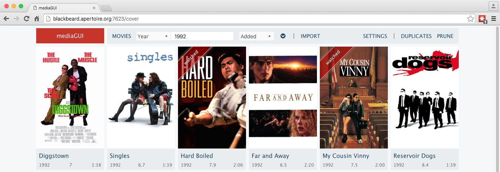
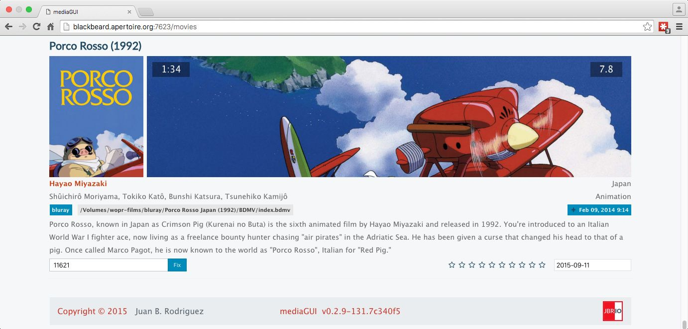

mediaGUI
========

*tl;dr* **mediaGUI** is a rewrite of [Mediabase](http://www.apertoire.net/introducing-mediabase) (code can be found [here](https://github.com/jbrodriguez/mediabase)), in order to learn [ReactJS](http://facebook.github.io/react/).

## Screenshots
Cover View

Movies View

## Rationale

AngularJS is a great framework that lends itself to rapid development.

When I started reading more and more about ReactJS, I looked at the sample code, thought it was a messy intermixing of css, javascript, html and went on my own Angular way.

But at some point, it all made sense.

In a common MVC architecture, ReactJS is the View.

React views are, for the most part, just smart enough to know **how** to display themselves, while other model-like components obtain and manipulate **what** shall be displayed.

In the end, this gives a far stronger separation of concerns and is a much simpler conceptual model for an application.

## Flux framework

In order to support the views, Facebook also defined the [Flux architecture](https://facebook.github.io/flux/).

Since it's more like a blueprint, many implementations were created, to try and improve upon it.

Some of the most interesting, currently, are:

- [Relay](https://facebook.github.io/relay/): Facebook's own re-invention of Flux
- [Redux](http://rackt.github.io/redux/): Has been gaining lot of traction recently
- [Refluxjs](https://github.com/reflux/refluxjs): One of the first in the arena
- [Cycle](http://cycle.js.org/): Based on a human/computer interaction, fully reactive
- [reactive approach](http://www.aryweb.nl/2015/02/16/Reactive-React-using-reactive-streams/): a very simple implementation based on [Bacon.js](https://baconjs.github.io/)
- [ffux](https://github.com/milankinen/ffux): A complete functional approach also based on Bacon.js

I went with ffux.

## ffux

ffux is based on the original stores and actions concepts, but dispenses with the dispatcher.

The powerful thing is that, while lowering complexity, you get to use a functional paradigm (via Bacon.js, but RxJX is also supported), to react to the typical stages/events of an application's lifetime.

Please read the [github page](https://github.com/milankinen/ffux) for a more detailed explanation.

## Installation/Development

The docs folder contains the schema for the sqlite db that supports the application.

### Folders
By default, the app will build/look for the following structure

~ (home folder) 
|_ /.mediagui (config file) 
|_ _ db (sqlite db) 
|_ _ web (index.html)  
|_ _ _ app (app bundle, css, fonts, etc) 
|_ _ _ img (storage for movie covers, backdrops, etc) 

### Client code
In the code's root folder, an `npm install` will download dependencies.

### Server code
A makefile in the server folder has different targets to build and serve the Go based back-end.

- `make build` build the binary
- `make serve` hot reload on code change for Go ;)

Pointing your browser to `localhost:7326` should do the trick.

## CSS/Flexbox

Just a quick note on the CSS code, as it is based on [flexbox](https://css-tricks.com/snippets/css/a-guide-to-flexbox/).

I used a slightly modified version of [flex-grid](https://github.com/VladShcherbin/flex-grid).

Simple yet highly expressive.

Very nice stuff.

## Final comments
ReactJS is definitely here to stay.

Its sibling, React Native is extremely powerful and lowers the entry barrier for javascript developers who want to do iOS apps (soon Android as well).

ffux offers one of the simplest conceptual understandings of the flux architecture, I hope it becomes more popular going forward.
