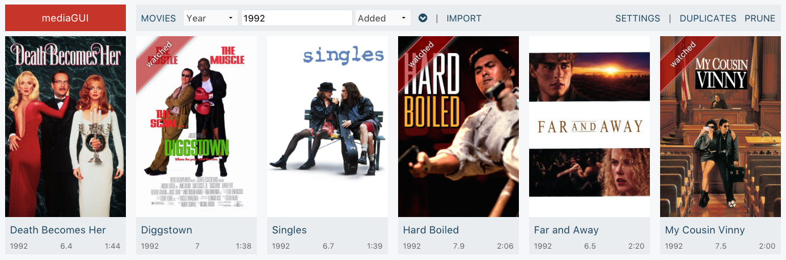
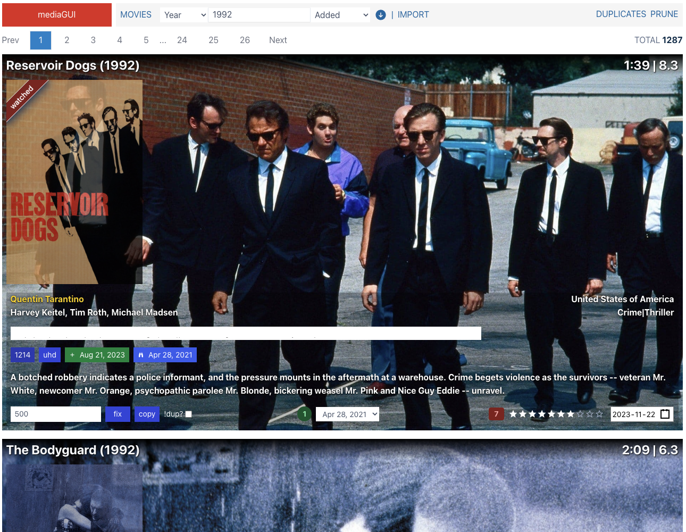

# mediaGUI

_tl;dr_ **mediaGUI** is a web based app to catalogue a movie library. It scans the folders you choose looking for movies, then fetch metadata from [themoviedb.org](www.themoviedb.org) and [iMDB](https://www.imdb.com).

## Screenshots

Cover View

Movies View

## Introduction

**mediaGUI**'s main objective is to be rewritten whenever I want to learn a new technology.

- 1st Iteration [(code)](https://github.com/jbrodriguez/mediabase/) 
  The project's first name was [mediabase](http://www.apertoire.net/introducing-mediabase)  
  To learn:

  - [go](https://golang.org/)
  - [AngularJS 1](https://angularjs.org/)

- 2nd Iteration [(code)](https://github.com/jbrodriguez/mediagui/tree/0.5.8/)  
  I renamed the project to **mediaGUI**  
  To learn:

  - [go-micro](https://github.com/micro/go-micro/): microservices in go
  - [react](http://facebook.github.io/react/)
  - [ffux](https://github.com/milankinen/ffux/): A functional approach to state management
  - [flexboxgrid-sass](https://github.com/hugeinc/flexboxgrid-sass/)

- 3rd Iteration [(code)](https://github.com/jbrodriguez/mediagui/tree/3.8.0/)  
  To learn:

  - [vuejs](https://vuejs.org/) - [tachyons-sass](https://github.com/tachyons-css/tachyons-sass)

- 4th Iteration [(code)](https://github.com/jbrodriguez/mediagui/tree/4.2.0/)  
  To learn:

  - [vue-cli](https://cli.vuejs.org/)
  - [vuex modules](https://vuex.vuejs.org/guide/modules.html)

- 5th Iteration [(code)](https://github.com/jbrodriguez/mediagui/tree/2023.11.22-882b833)  
  To learn:

  - [gRPC](https://gprc.io/)

- 6th Iteration [(code)](https://github.com/jbrodriguez/mediagui/)  
  To learn:

  - [swr](https://swr.vercel.app/)

## Summary

### 6th Iteration

- update stack to vitejs
- modernize go code
- i touch this project sparingly, so I'm switching back to react for easier maintenance
- swr for data fetching

### 5th Iteration

gRPC is easier to work with than go-micro (+consul).

### 4th Iteration

@vue-cli 3.x is an awesome tool.

I'd say it's the reference right now, like parceljs on steroids for vuejs.

I can't say the same about vuex modules.

It's probably because I'm using class decorators and typescript, but namespacing doesn't feel quite right.

Hopefully vue 3.x will improve in that aspect.

### 3rd Iteration

vuejs is a pleasure to work with.

Its main assets are:

- [vue-cli](https://github.com/vuejs/vue-cli): creates a starter project, you just need to start coding and not worry about tooling
- [vuex](https://github.com/vuejs/vuex): opinionated and easy state management

The combination of vue-cli/vuex takes away a lot of the guess work that you generally find in redux (how to structure the app, etc.).

Although vuex has some boilerplate, it still feels less than redux's.

## App Structure

The docs folder contains the schema for the sqlite db that supports the application.

By default, the app will build/look for the following structure

~ (home folder) 
|\_ .mediagui 
|\_**\_ mediagui.conf (if required) 
|\_\_** db (sqlite db) 
|\_**\_ web 
|\_\_\_\_** index.html  
|**\_\_** js 
|**\_\_** css 
|**\_\_** img (storage for movie covers, backdrops, etc) 
