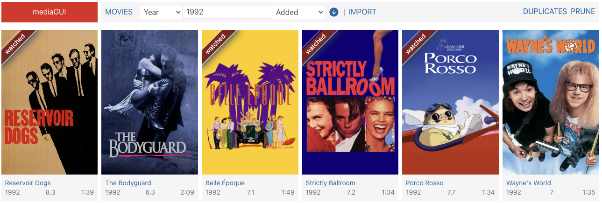

mediaGUI
========

*tl;dr* **mediaGUI** is a web based app to catalogue a movie library. It scans the folders you choose looking for movies, then fetch metadata from [themoviedb.org](www.themoviedb.org) and [The OMDB API](www.omdbapi.com).

## Screenshots
Cover View

Movies View

## Introduction
**mediaGUI**'s main objective is to be rewritten whenever I want to learn a new technology.

- 1st Iteration [(code)](https://github.com/jbrodriguez/mediabase/)  
The project's first name was [mediabase](http://www.apertoire.net/introducing-mediabase)   
To learn:
	- [go](https://golang.org/)
	- [AngularJS 1](https://angularjs.org/)

- 2nd Iteration [(code)](https://github.com/jbrodriguez/mediagui/tree/0.5.8/)  
I renamed the project to **mediaGUI**  
To learn:
	- [go-micro](https://github.com/micro/go-micro/): microservices in go
	- [react](http://facebook.github.io/react/)
	- [ffux](https://github.com/milankinen/ffux/): A functional approach to state management
	- [flexboxgrid-sass](https://github.com/hugeinc/flexboxgrid-sass/)

- 3rd Iteration [(https://github.com/jbrodriguez/mediagui/)]  
To learn:
	- [vuejs](https://vuejs.org/)
	- [tachyons-sass](https://github.com/tachyons-css/tachyons-sass)

## Summary
vuejs is a pleasure to work with.

Its main assets are:
- [vue-cli](https://github.com/vuejs/vue-cli): creates a starter project, you just need to start coding and not worry about tooling
- [vuex](https://github.com/vuejs/vuex): opinionated and easy state management

The combination of vue-cli/vuex takes away a lot of the guess work that you generally find in redux (how to structure the app, etc.).

Although vuex has some boilerplate, it still feels less than redux's.

## App Structure
The docs folder contains the schema for the sqlite db that supports the application.

By default, the app will build/look for the following structure

~ (home folder) 
|_ .mediagui 
|____ mediagui.conf (if required) 
|____ db (sqlite db) 
|____ web 
|______ index.html  
|______ js 
|______ css 
|______ fonts 
|______ img (storage for movie covers, backdrops, etc) 
